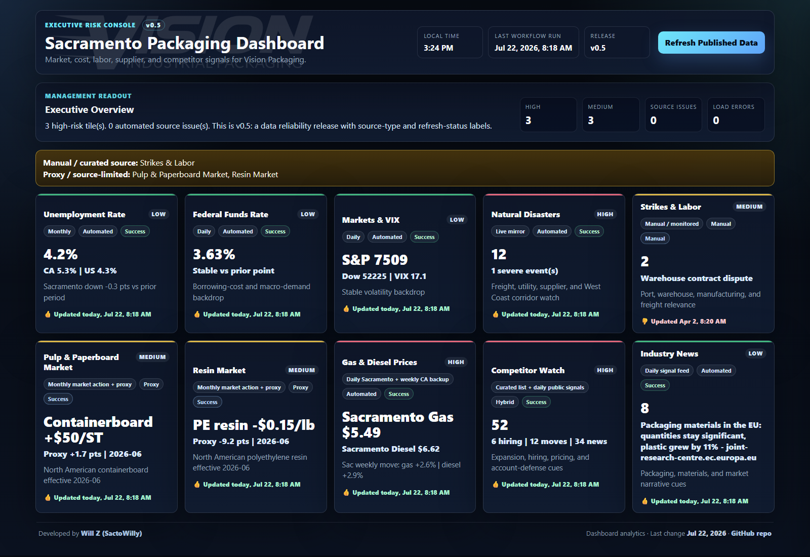

# Sacramento Packaging Dashboard

Executive risk console for Vision Packaging, focused on the Sacramento packaging market. The dashboard combines public market, cost, labor, disaster, competitor, fuel, and industry-news signals into a single operating view for ownership and sales/ops decision-making.



## What This Does

This is a static GitHub Pages dashboard with scheduled data refreshes. It does not require a backend server. The app loads published JSON files from `data/`, computes tile-level executive insights in `app.js`, and presents both a fast overview and deeper flyout panels.

The dashboard is designed to answer practical ownership questions:

- Are any external signals strong enough to change pricing, quote windows, credit posture, delivery assumptions, or account-defense work?
- Which inputs are current, stale, manual, proxy-based, or source-limited?
- What should sales, operations, purchasing, or ownership do next?
- Which signals need verification before they are used in customer or supplier conversations?

## How To Read It

Start with the **Executive Overview**. It summarizes high-risk tiles, medium-risk tiles, source issues, and load errors. A healthy data run should show `0` load errors and clearly separate automated, manual, proxy, and hybrid sources.

Read each tile in this order:

1. **Risk label**: `Low`, `Medium`, or `High` shows whether the signal needs attention.
2. **Source chips**: show freshness, source type, and refresh status.
3. **Headline value**: the key operating signal, such as Sacramento fuel, VIX, containerboard action, or competitor activity.
4. **Updated stamp**: green means updated today, yellow means within 30 days, red means older than 30 days or missing.
5. **Click the tile**: the flyout explains what changed, why it matters, how Vision Packaging can use it, data quality, source links, and the operating playbook.

## Flyout Sections

Each flyout is built to support a management conversation, not just display a number.

- **Executive Read**: plain-English readout of the current signal.
- **Recommended Action**: the immediate management move, if any.
- **Ownership Decision Lens**: decision question, escalation trigger, and owner move.
- **History / Trend**: published history or chart-backed trend where available.
- **Operating Playbook**: concrete questions and follow-up actions for sales, operations, purchasing, or ownership.
- **Why This Matters**: business relevance for packaging operations.
- **How Vision Packaging Can Use This**: practical use in quoting, account planning, supplier review, delivery planning, or sales messaging.
- **Data Quality**: source type, refresh status, limitations, and proxy/manual context.
- **Sources**: published source links used by the tile.

## Source Types

The dashboard labels source quality directly so users do not mistake a workflow timestamp for universal freshness.

- **Automated**: refreshed by workflow from a public source.
- **Manual**: curated or starter data that should be reviewed by a human.
- **Proxy**: public directional indicator used when exact commercial pricing is not freely available.
- **Hybrid**: curated entity list with automated public signals layered on top.

For example, pulp/paperboard leads with the operational market action mills and sheet plants use, such as `Containerboard +$50/ST`, while public FRED/BLS data is treated as supporting proxy context.

## Data Refresh

The GitHub Actions workflow `.github/workflows/update-data.yml` runs on weekdays and can also be triggered manually. It refreshes:

- unemployment
- Federal Funds Rate
- Sacramento and California fuel data
- natural disasters
- market/VIX data
- pulp and resin market/proxy data
- industry news
- competitor public signals
- labor data when the source is available
- build metadata

The frontend refresh button reloads the already-published JSON files with cache-busting. It does not scrape live websites from the browser.

## Validation

The repo includes two validation gates:

- `scripts/validate_data.py` checks JSON parseability, source metadata, refresh status, and competitor hiring link quality.
- `scripts/validate_dashboard_content.js` executes `app.js` against the published JSON files and verifies that every flyout has the required executive/actionability sections.

Run locally:

```powershell
node --check app.js
node scripts\validate_dashboard_content.js
python scripts\validate_data.py
```

If local `python` is not installed, use the bundled Codex Python runtime or GitHub Actions.

## Project Structure

```text
index.html                     Static dashboard shell
style.css                      Dashboard layout and visual design
app.js                         Tile logic, flyouts, charts, and client refresh
config.js                      Data-file configuration
assets/dashboard-overview.png  README dashboard image
data/*.json                    Published dashboard data
scripts/update_*.py            Data refresh scripts
scripts/validate_data.py       Data validation gate
scripts/validate_dashboard_content.js  Flyout/actionability validation gate
.github/workflows/update-data.yml      Scheduled refresh workflow
```

## Developer

Developed by [Will Z (SactoWilly)](https://github.com/sactowilly).

Repo: [sactowilly/vsn-dashboard](https://github.com/sactowilly/vsn-dashboard)
